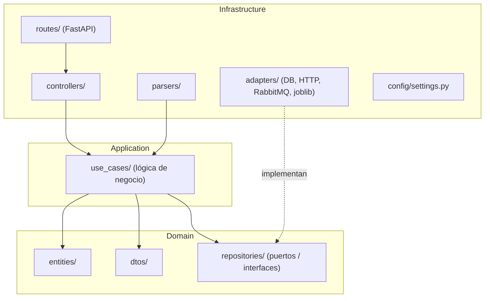
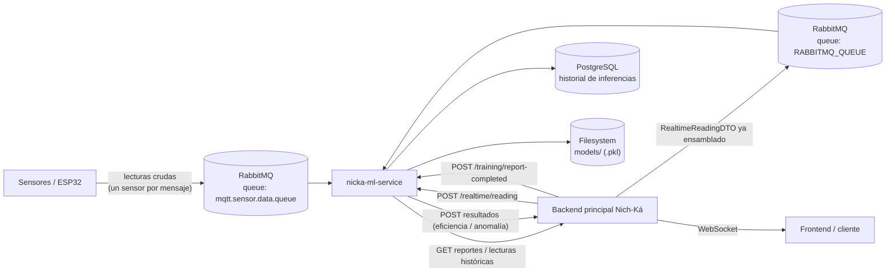

# Arquitectura

[← Volver al README](../README.md)

## Propósito y responsabilidad del servicio

`nicka-ml-service` es el microservicio de **Machine Learning** de la plataforma Nich-Ká. Su responsabilidad es:

- Predecir la **eficiencia final (%)** de una fermentación en curso.
- Detectar **anomalías** en el proceso a partir de lecturas de sensores.
- Generar datasets (sintéticos o desde datos reales) y entrenar/reentrenar los modelos anteriores.
- Exponer estas capacidades vía API HTTP y consumo de mensajería (RabbitMQ).

Explícitamente **no** es responsable de: la persistencia de sesiones de fermentación, la gestión de usuarios/salones, ni de mantener la conexión WebSocket con el cliente final — todo eso vive en el **backend principal** de Nich-Ká, con quien este servicio se integra.

## Estilo arquitectónico

El proyecto implementa **arquitectura limpia (Clean/Hexagonal Architecture)**, organizada en tres capas con dependencias apuntando siempre hacia el dominio:

- **Domain**: entidades del negocio (`FermentationProfile`, `KineticParameters`, `SensorReading`, `AnomalyInference`, `SensorCalibration`), DTOs (contratos Pydantic) y **puertos** (`*Repository`, `NotificationPublisher`) como interfaces abstractas (`ABC`). No depende de ninguna otra capa.
- **Application**: casos de uso (`use_cases/`), cada uno con responsabilidad única (generación de datasets, feature engineering, inferencia en tiempo real, entrenamiento, reentrenamiento). Depende solo de `domain`, nunca de `infrastructure`.
- **Infrastructure**: implementaciones concretas de los puertos (`adapters/`), rutas HTTP (`routes/`), controladores (`controllers/`), parsers de archivos y configuración. Es la única capa que conoce frameworks/librerías externas (FastAPI, psycopg2, httpx, joblib, aio-pika).

Este diseño permite, por ejemplo, cambiar el almacenamiento de inferencias de PostgreSQL a otro motor implementando un nuevo adapter de `InferenceRepository`, sin tocar los casos de uso.

## Componentes principales

| Componente | Rol |
|---|---|
| `main.py` | Arranca FastAPI, ambos consumers de RabbitMQ y el scheduler de reentrenamiento nocturno (`lifespan`). |
| `routes/` | Definición de endpoints REST (`predict`, `detect`, `realtime`, `training`, `inferences`). |
| `controllers/` | Traducen petición HTTP → caso de uso → respuesta. Sin lógica de negocio. |
| `use_cases/realtime` | Orquestan la inferencia en tiempo real (predicción + detección + notificación), incluyendo el flujo dedicado de anomalías desde datos crudos de sensores (`ProcessMqttSensorReading`). |
| `use_cases/training` | Entrenamiento inicial y reentrenamiento incremental de ambos modelos. |
| `use_cases/feature_engineering` | Extracción de features para cada modelo. |
| `use_cases/simulation` + `dataset_generation` | Simulador cinético y generación de datasets sintéticos/reales. |
| `adapters/joblib_model_repository.py` | Persistencia de modelos/scalers en disco (`models/`). |
| `adapters/postgres_inference_repository.py` | Persistencia del historial de inferencias de anomalía en PostgreSQL. |
| `adapters/rabbitmq_consumer.py` | Consume lecturas ya ensambladas (`RealtimeReadingDTO`) desde `RABBITMQ_QUEUE`, para el flujo combinado de predicción + detección. |
| `adapters/mqtt_sensor_consumer.py` | Consume lecturas crudas de UN sensor por mensaje desde `mqtt.sensor.data.queue` (bridge MQTT), dedicado exclusivamente a detección de anomalías en tiempo real. |
| `adapters/in_memory_circuit_sensor_state_repository.py` | Mantiene en memoria, por circuito, el último valor conocido de cada sensor y una ventana deslizante de snapshots (últimas 2h), para reconstruir lecturas completas a partir de mensajes de un solo sensor. |
| `adapters/websocket_notification_publisher.py` | Publica resultados (predicción/anomalía) de vuelta al backend vía HTTP. |
| `adapters/http_*_repository.py` | Consultan al backend principal (reportes de fermentación, lecturas de sensores). |
| APScheduler (`main.py`) | Job cron diario (`02:00`) que dispara el reentrenamiento incremental por lotes. |

## Integración con el resto de la plataforma

Puntos de integración:

- **RabbitMQ — cola ensamblada (`RABBITMQ_QUEUE`)**: el servicio consume lecturas ya armadas como `RealtimeReadingDTO` (adapter `RabbitMQConsumer`), como vía alternativa/asíncrona al endpoint HTTP `POST /realtime/reading`. Ambos caminos ejecutan `ProcessRealtimeReading`, que corre predicción de eficiencia **y** detección de anomalías.
- **RabbitMQ — cola cruda de sensores (`mqtt.sensor.data.queue`)**: conexión **independiente** (servidor/credenciales propios, `MQTT_SENSOR_RABBITMQ_URL`), dedicada exclusivamente a detección de anomalías en tiempo real. El adapter `MqttSensorConsumer` consume un mensaje por sensor individual (formato del bridge MQTT), reconstruye snapshots completos en memoria (`InMemoryCircuitSensorStateRepository`) y dispara `ProcessMqttSensorReading` sin depender de que el backend ensamble nada — es el camino "real-time puro" del Isolation Forest.
- **Backend principal (HTTP)**: el ML service consulta al backend para obtener reportes de fermentación completados (`BACKEND_REPORTS_ENDPOINT`) y el historial completo de lecturas de una sesión (`BACKEND_SENSORS_ENDPOINT`), y le publica de vuelta los resultados de predicción/detección (`BACKEND_NOTIFICATIONS_ENDPOINT`) para que el backend los reenvíe por WebSocket al cliente final. Este servicio **no** mantiene conexión WebSocket directa con el frontend.
- **PostgreSQL**: base de datos propia del microservicio, usada únicamente para el historial de inferencias de anomalía (`anomaly_inferences`). No comparte base de datos con el backend.
- **Filesystem**: los modelos entrenados y sus escaladores (`StandardScaler`) se serializan con `joblib` en el directorio `MODELS_DIR`.

> ⚠️ **Nota operativa**: mientras ambos caminos de anomalías coexistan (el de `RABBITMQ_QUEUE`/`POST /realtime/reading` vía `ProcessRealtimeReading`, y el nuevo de `mqtt.sensor.data.queue` vía `ProcessMqttSensorReading`), un mismo circuito con sesión activa puede generar **inferencias de anomalía duplicadas** en `anomaly_inferences` si el backend sigue disparando el flujo viejo además del nuevo. Si el objetivo es que `mqtt.sensor.data.queue` sea la única fuente de verdad para anomalías, conviene coordinar con el equipo de backend para dejar de invocar la detección desde el flujo ensamblado.

## Decisiones de diseño relevantes

- **Responsabilidad única por caso de uso**: cada `use_case` hace una sola cosa (p. ej. `PredictEfficiency` solo predice, no decide *cuándo* predecir — eso lo hace `ProcessRealtimeReading`).
- **Puertos y adaptadores**: todo acceso externo (BD, HTTP, colas, filesystem) pasa por una interfaz (`domain/repositories`), permitiendo sustituir implementaciones sin tocar la lógica de negocio.
- **Entrenamiento con datos insuficientes**: tanto `TrainEfficiencyModel` como `TrainAnomalyModel` degradan de forma controlada cuando hay pocas muestras (entrenan sin split de validación y marcan el resultado como `validated: false`), en vez de fallar.