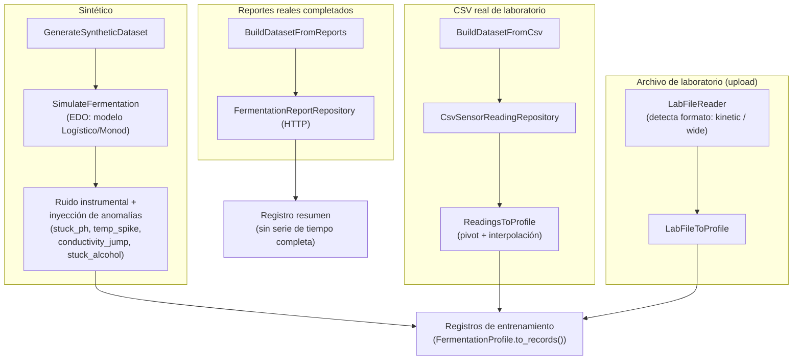
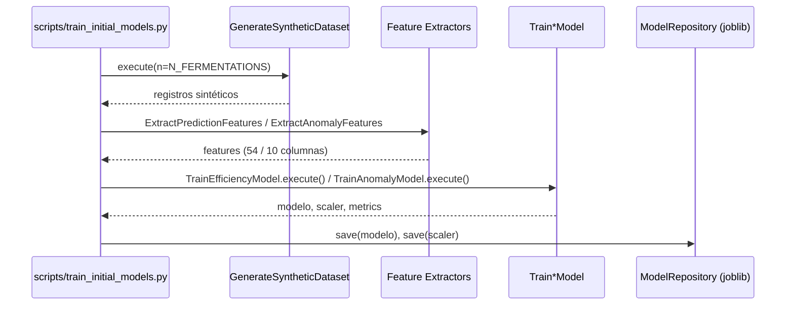
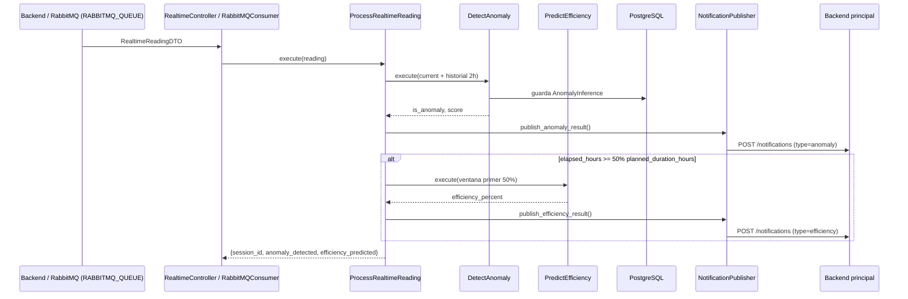
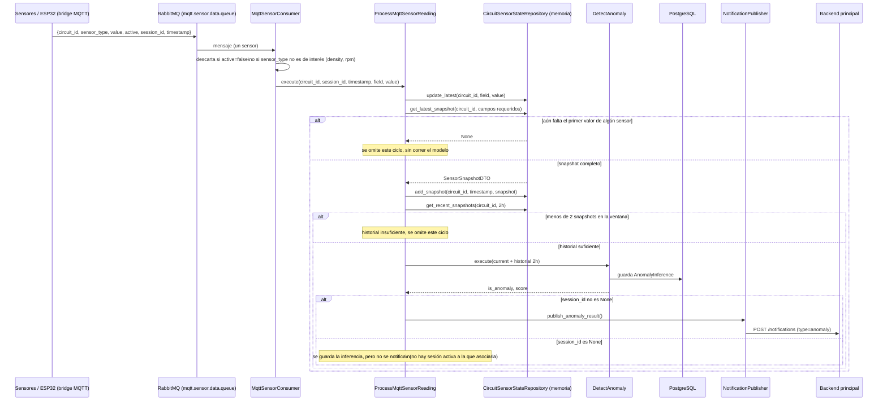
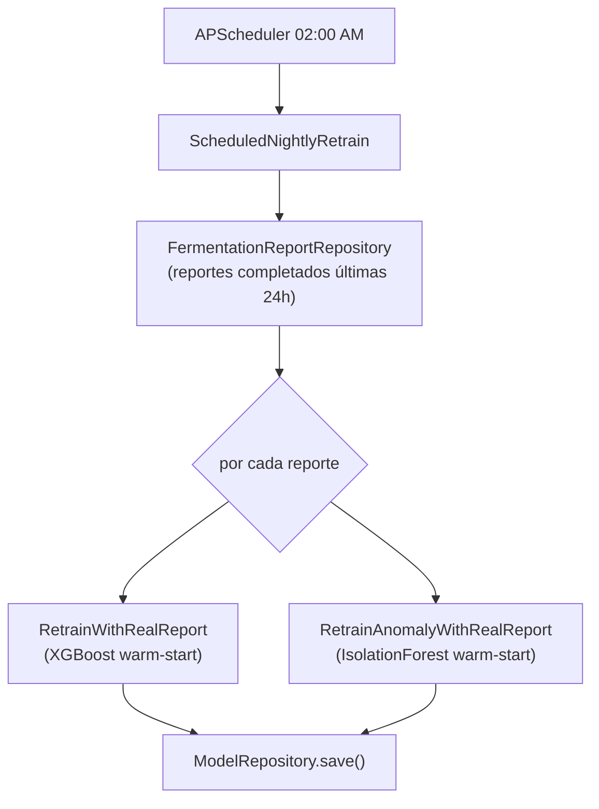

# Flujo de procesamiento de datos

[← Volver al README](../README.md)

Este documento describe los cuatro flujos de datos del servicio: generación de datasets, entrenamiento inicial, inferencia en tiempo real, y reentrenamiento incremental.

## 1. Generación de datasets de entrenamiento

Existen tres fuentes de datos para entrenar los modelos, todas convergen al mismo formato de registro (una fila por timestamp, con columnas de sensores + `is_anomaly` + `final_efficiency_percent`):

- **Sintético** (`scripts/train_initial_models.py`, `GenerateSyntheticDataset`): resuelve las EDO del modelo cinético (Logístico calibrado con R²=0.9955, o Monod) con `scipy.odeint`, convierte biomasa/azúcar/etanol a lecturas de sensor (`SensorProfileMapper`), agrega ruido gaussiano + deriva, e inyecta anomalías en ~10 % de las fermentaciones (tasa `ANOMALY_RATE`).
- **CSV real** (`BuildDatasetFromCsv`): lee un CSV de formato ancho (una columna por sensor) y lo convierte a perfil vía `ReadingsToProfile`.
- **Archivo de laboratorio subido** (`/training/*/upload`): `LabFileReader` detecta si el archivo es formato `kinetic` (columnas crudas de laboratorio: azúcares/etanol reales — permite reconstruir biomasa por balance de masa y calcular la eficiencia real) o `wide` (ya son lecturas de sensor, requiere `efficiency_override` explícito porque no trae azúcar/etanol).
- **Reportes reales** (`BuildDatasetFromReports`): a diferencia de las otras fuentes, produce un registro resumen (valores inicial/final/última lectura), sin serie de tiempo completa — se usa principalmente para análisis agregado, no para entrenar directamente los modelos de series de tiempo.

## 2. Entrenamiento inicial

Este flujo corre en el `Dockerfile` durante el *build* de la imagen (`RUN python scripts/train_initial_models.py`), garantizando que el servicio arranque con modelos base disponibles.

## 3. Inferencia en tiempo real — flujo combinado (predicción + anomalía)

Flujo activado por el backend cuando ya tiene una lectura ensamblada: se ejecuta **siempre** la detección de anomalías, y la **predicción de eficiencia solo si ya se alcanzó el 50 % del tiempo planeado** de la fermentación.

Dos vías de entrada equivalentes disparan este mismo flujo:

1. **HTTP**: `POST /api/v1/realtime/reading`, llamado por el backend.
2. **RabbitMQ**: `RabbitMQConsumer` escuchando la cola `RABBITMQ_QUEUE`, con el `RealtimeReadingDTO` ya armado por el backend.

Este flujo sigue siendo la única vía para la **predicción de eficiencia** (necesita `elapsed_hours`/`planned_duration_hours`, que solo conoce el backend). Para anomalías, ver la sección siguiente.

## 3.1. Detección de anomalías dedicada — datos crudos de sensores (`mqtt.sensor.data.queue`)

Camino **independiente** del anterior, pensado para que la detección de anomalías reaccione a cada lectura real de sensor sin esperar a que el backend arme nada — es el flujo verdaderamente en tiempo real del Isolation Forest.

A diferencia de `RABBITMQ_QUEUE`, esta cola recibe **un mensaje por sensor individual** (`circuit_id`, `sensor_type`, `value`, `active`, `session_id`, `timestamp`), publicado directamente por el bridge MQTT → RabbitMQ. Por eso hace falta reconstruir el snapshot completo (los 5 sensores) en memoria antes de poder correr el modelo.

Puntos clave de este flujo:

- **Conexión propia**: usa un servidor/credenciales de RabbitMQ independientes del resto (`MQTT_SENSOR_RABBITMQ_URL`), configurables por variable de entorno.
- **Estado en memoria por circuito**: `InMemoryCircuitSensorStateRepository` mantiene (a) el último valor conocido de cada sensor y (b) una ventana deslizante de snapshots ya armados (últimas 2h, anclada al timestamp del snapshot más reciente, no al reloj de pared). Es estado de un solo proceso — si el servicio se reinicia o se escala a varias réplicas, la ventana se reconstruye desde cero / queda fragmentada entre réplicas (ver nota de escalabilidad en `docs/architecture.md`).
- **Solo anomalías**: este flujo no hace predicción de eficiencia — para eso sigue siendo necesario el flujo de la sección 3.
- **Coexistencia con el flujo viejo**: mientras el backend siga disparando también el flujo de la sección 3 (que igualmente corre `DetectAnomaly`), pueden generarse inferencias de anomalía duplicadas para un mismo circuito/sesión. Ver nota operativa en `docs/architecture.md`.

## 4. Reentrenamiento incremental

Dos vías:

- **Puntual**, disparado por el backend cuando una fermentación termina: `POST /training/report-completed` → `RetrainWithRealReport` (eficiencia) — este endpoint específico no ejecuta el reentrenamiento de anomalías, solo el de eficiencia. El de anomalías (`RetrainAnomalyWithRealReport`) se ejecuta como parte del batch nocturno.
- **Batch nocturno** (`ScheduledNightlyRetrain`, cron `02:00` vía APScheduler): recorre todos los reportes completados en las últimas 24 h y reentrena **ambos** modelos de forma incremental (warm start), de forma independiente por modelo — un fallo en uno no detiene al otro.

Ambos reentrenamientos reutilizan el **mismo scaler** ya ajustado (no se hace `fit_transform` de nuevo), para mantener consistente la distribución de referencia entre reentrenamientos sucesivos.