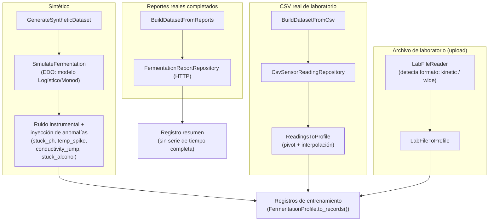
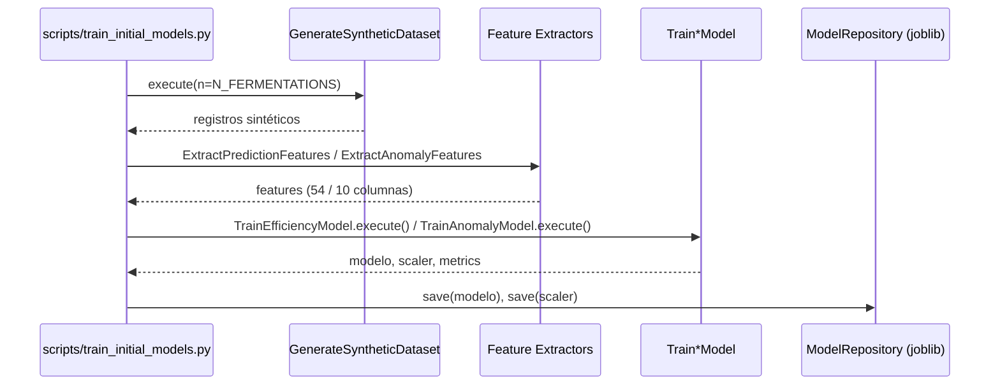
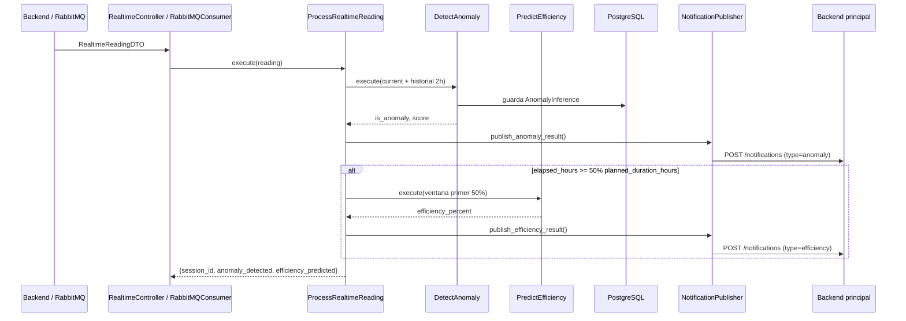
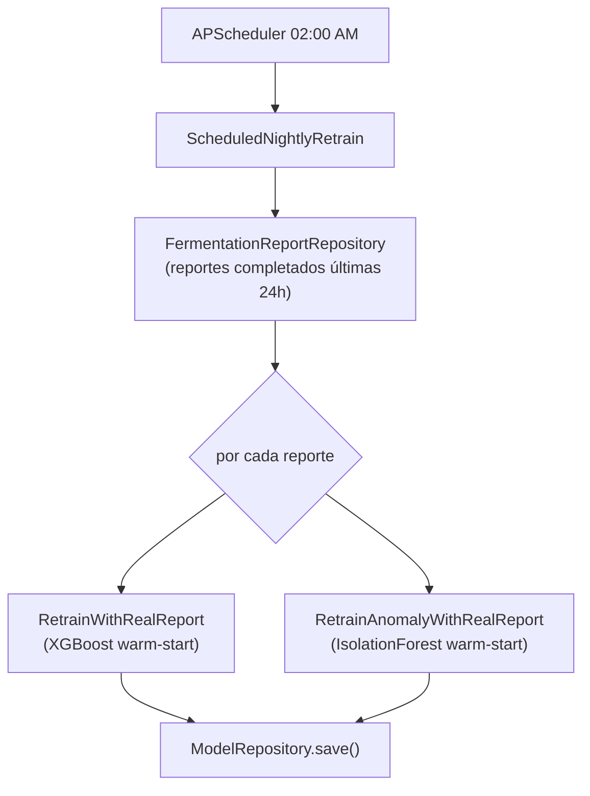

# Flujo de procesamiento de datos

[← Volver al README](../README.md)

Este documento describe los cuatro flujos de datos del servicio: generación de datasets, entrenamiento inicial, inferencia en tiempo real, y reentrenamiento incremental.

## 1. Generación de datasets de entrenamiento

Existen tres fuentes de datos para entrenar los modelos, todas convergen al mismo formato de registro (una fila por timestamp, con columnas de sensores + `is_anomaly` + `final_efficiency_percent`):

- **Sintético** (`scripts/train_initial_models.py`, `GenerateSyntheticDataset`): resuelve las EDO del modelo cinético (Logístico calibrado con R²=0.9955, o Monod) con `scipy.odeint`, convierte biomasa/azúcar/etanol a lecturas de sensor (`SensorProfileMapper`), agrega ruido gaussiano + deriva, e inyecta anomalías en ~10 % de las fermentaciones (tasa `ANOMALY_RATE`).
- **CSV real** (`BuildDatasetFromCsv`): lee un CSV de formato ancho (una columna por sensor) y lo convierte a perfil vía `ReadingsToProfile`.
- **Archivo de laboratorio subido** (`/training/*/upload`): `LabFileReader` detecta si el archivo es formato `kinetic` (columnas crudas de laboratorio: azúcares/etanol reales — permite reconstruir biomasa por balance de masa y calcular la eficiencia real) o `wide` (ya son lecturas de sensor, requiere `efficiency_override` explícito porque no trae azúcar/etanol).
- **Reportes reales** (`BuildDatasetFromReports`): a diferencia de las otras fuentes, produce un registro resumen (valores inicial/final/última lectura), sin serie de tiempo completa — se usa principalmente para análisis agregado, no para entrenar directamente los modelos de series de tiempo.

## 2. Entrenamiento inicial

Este flujo corre en el `Dockerfile` durante el *build* de la imagen (`RUN python scripts/train_initial_models.py`), garantizando que el servicio arranque con modelos base disponibles.

## 3. Inferencia en tiempo real

Es el flujo principal en producción: por cada lectura de sensores de una sesión activa, se ejecuta **siempre** la detección de anomalías, y la **predicción de eficiencia solo si ya se alcanzó el 50 % del tiempo planeado** de la fermentación.

Dos vías de entrada equivalentes disparan este mismo flujo:

1. **HTTP**: `POST /api/v1/realtime/reading`, llamado por el backend.
2. **RabbitMQ**: `RabbitMQConsumer` escuchando la cola `RABBITMQ_QUEUE`, para el camino asíncrono desde los sensores (ESP32).

## 4. Reentrenamiento incremental

Dos vías:

- **Puntual**, disparado por el backend cuando una fermentación termina: `POST /training/report-completed` → `RetrainWithRealReport` (eficiencia) — este endpoint específico no ejecuta el reentrenamiento de anomalías, solo el de eficiencia. El de anomalías (`RetrainAnomalyWithRealReport`) se ejecuta como parte del batch nocturno.
- **Batch nocturno** (`ScheduledNightlyRetrain`, cron `02:00` vía APScheduler): recorre todos los reportes completados en las últimas 24 h y reentrena **ambos** modelos de forma incremental (warm start), de forma independiente por modelo — un fallo en uno no detiene al otro.

Ambos reentrenamientos reutilizan el **mismo scaler** ya ajustado (no se hace `fit_transform` de nuevo), para mantener consistente la distribución de referencia entre reentrenamientos sucesivos.