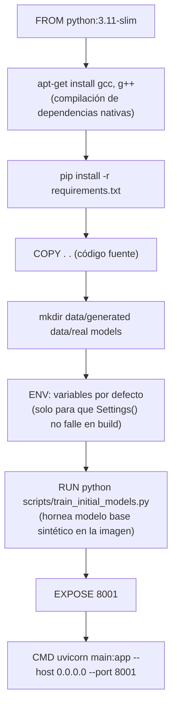

# Instalación, ejecución local y despliegue

[← Volver al README](../README.md)

## Requisitos previos

- Python 3.11+ (la imagen Docker usa `python:3.11-slim`)
- `pip`
- Docker (opcional, para ejecución/despliegue en contenedor)
- Acceso a una instancia de PostgreSQL
- Acceso a una instancia de RabbitMQ (o CloudAMQP)
- URL accesible del backend principal Nich-Ká

## Instalación y ejecución local

### 1. Clonar el repositorio

```bash
git clone https://github.com/ESTSOFTWARE/ML_FERMENTADOR.git
cd nicka-ml-service
```

### 2. Crear y activar entorno virtual

```bash
python -m venv venv
source venv/bin/activate      # Windows: venv\Scripts\activate
```

### 3. Instalar dependencias

```bash
pip install -r requirements.txt
```

### 4. Configurar variables de entorno

Crear un archivo `.env` en la raíz del proyecto siguiendo la plantilla de [docs/configuration.md](configuration.md#archivo-envexample-sugerido).

### 5. Generar/entrenar los modelos iniciales

Los endpoints de predicción y detección requieren que `models/xgboost_efficiency.pkl` / `iforest_anomaly.pkl` (y sus scalers) ya existan; de lo contrario responden `503`. Para entrenarlos con datos sintéticos:

```bash
python -m scripts.train_initial_models
```

### 6. Ejecutar el servicio

```bash
python main.py
```

o, equivalentemente, con recarga automática en desarrollo:

```bash
uvicorn main:app --reload --host 0.0.0.0 --port 8000
```

Al arrancar, `main.py` (bloque `lifespan`) también:

- Conecta el **consumer de RabbitMQ** (`RabbitMQConsumer`) a la cola `RABBITMQ_QUEUE`.
- Registra el **job cron** de reentrenamiento nocturno (`02:00 AM`) vía `APScheduler`.

Si `DEBUG=True`, la documentación interactiva queda disponible en `http://localhost:<API_PORT>/docs`.

### 7. Verificar

```bash
curl http://localhost:8000/health
# {"status": "ok"}
```

Ejemplos de payloads reales para probar cada endpoint están disponibles en [docs/api.md](api.md).

## Ejecución con Docker (local)

```bash
docker build -t nicka-ml-service .
docker run --rm -p 8001:8001 --env-file .env nicka-ml-service
```

> El `Dockerfile` expone el puerto **8001** internamente (`EXPOSE 8001`, `CMD uvicorn ... --port 8001`), mientras que el `.env` de ejemplo del proyecto usa `API_PORT=8000` para ejecución directa con `python main.py`. Al containerizar, asegúrate de que `API_PORT`/el mapeo de puertos de Docker sean consistentes con el puerto real donde escucha Uvicorn (`8001`, fijado en el `CMD` del Dockerfile).

## Proceso de build de la imagen (`Dockerfile`)



Puntos clave del build:

1. **Dependencias del sistema**: `gcc`/`g++` se instalan porque algunas dependencias de ML compilan extensiones nativas.
2. **Variables de entorno del build**: el `Dockerfile` define valores por defecto (`ENV ...`) únicamente para que `Settings()` no falle durante `RUN python scripts/train_initial_models.py`. **No son credenciales de producción** — el runtime real las inyecta la plataforma de despliegue (variables de entorno del servicio/proyecto), sobrescribiendo estos defaults.
3. **Modelo base horneado en la imagen**: el entrenamiento inicial con datos sintéticos corre en tiempo de *build*, no en el arranque del contenedor — esto garantiza que cualquier instancia nueva arranque ya con modelos disponibles, sin depender de un volumen persistente previo.
4. **Puerto**: el contenedor expone y sirve en `8001`.

## Despliegue

El comentario en el `Dockerfile` (`"las reales las inyecta Railway en tiempo de ejecución"`) indica que el servicio está pensado para desplegarse en **Railway** (o una plataforma equivalente basada en contenedores), donde:

1. Railway construye la imagen a partir del `Dockerfile` del repositorio.
2. Las variables de entorno reales (DB, RabbitMQ, backend, etc.) se configuran en el panel de la plataforma como *environment variables* del servicio, sobrescribiendo los valores por defecto usados solo durante el build.
3. El contenedor arranca con `uvicorn main:app --host 0.0.0.0 --port 8001`, exponiendo la API al backend principal.
4. Al ser *stateless* respecto a los modelos entrenados por reentrenamiento incremental (se guardan en el filesystem del contenedor, no en un volumen persistente por defecto), cualquier reentrenamiento incremental (`/training/report-completed`, job nocturno) **se pierde si el contenedor se reconstruye o reinicia sin un volumen persistente montado en `MODELS_DIR`**. Si se requiere persistencia entre despliegues, se debe montar un volumen o migrar `ModelRepository` a un almacenamiento externo (ej. S3) implementando un nuevo adapter.

### Checklist de despliegue

- [x] Variables de entorno de producción configuradas en la plataforma (ver [docs/configuration.md](configuration.md)), **no** hardcodeadas en el `Dockerfile`.
- [x] `DEBUG=false` en producción (deshabilita `/docs`, `/redoc`, `/openapi.json`).
- [x] Instancia de PostgreSQL accesible y con las credenciales correctas (la tabla `anomaly_inferences` se crea automáticamente al arrancar, `CREATE TABLE IF NOT EXISTS`).
- [x] Cola de RabbitMQ (`RABBITMQ_QUEUE`) existente y accesible.
- [x] `BACKEND_BASE_URL` y endpoints relativos apuntando al backend principal correcto del ambiente.